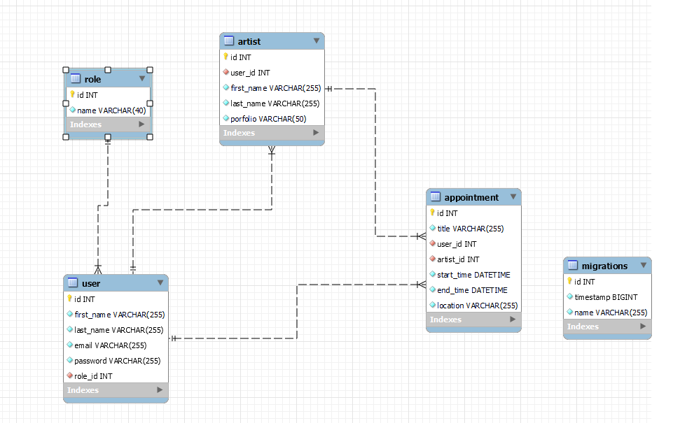

# API REST para un estudio de tatuajes 

## Descripción

El proyecto consiste en desarrollar una API REST para la gestión de citas  de un estudio de tauajes. La API permitirá a los usuarios realizar operaciones como registar,login , actualizar y eliminar citas, gestionar usuarios y artistas


## Características Principales

- Gestión de Usuarios
- Gestión de citas
- Gestión de Artistas
- Visualización de citas
- Actualizacion de citas
- Visualización de Usuarios
- Visualización de perfil
- Actualizacion de Perfil de Usuario
- Registro y Login de Usuarios

## Tecnologías
-  **Javascript**.
-  **Express.js**.
- ORM: **TypeOrm**.
-  **TypeScript**.

## Base de Datos Relacional

## Endpoints principales

### Users

| Método | URI                              | Acción                     | Rol     |
|--------|----------------------------------|----------------------------|---------|
| POST   | `/api/users/registerAdmin`       | Registrar                  | admin   |
| POST   | `/api/users/registerArtist`      | Registrar                  | artist  |
| POST   | `/api/users/register`            | Registrar                  | client  |
| POST   | `/api/users/login `              | Actualiza perfil           | client  |
| GET    | `/api/users/profile `            | Obtener usuario            | client  |
| GET    | `/api/users/artists/list`        | Obtener lista de artistas  | admin   |
| GET    | `/api/users//getall  `           | ver todos los usuarios     | client  |
| Patch  | `/api/users/profile/update `     | actualizar datos de usuario| client  |


### Appointments

| Método | URI                                    | Acción         | Rol         |
|--------|----------------------------------------|----------------|-------------|
| POST   | `/api/appointments/newAppointment`     | Crear cita     | client      |
| PATCH  | `/api/appointments/:id`                | Actualizar     | admin       |
| DELETE | `/api/appointments/delete/:id`         | Eliminar citas | client      |
| GET    | `/api/appointments/mysessions/:id`     | ver cita por id| client      |
| GET    | `/api/appointments/myappointments/:id` |ver citas artist| artist      |
| GET    | `/api/appointments/get`                |ver todas citas | admin       |


##  Instalación en local
1. Clonar el repositorio
2. ` $ npm install `
3. Conectamos la base de datos que se encunetra en el archivo ```.env ```.
 ```  // Environment variables ```
   ```  NODE_ENV= ```

   ```   // Server configuration```
   ```   PORT=```

   ```  // Database configuration```
	```DB_HOST=```
	```DB_PORT=```
	```DB_USER=```
	```DB_PASSWORD=```
	```DB_DATABASE=  ```

   ``` // Secret Token```
	```JWT_SECRET= "" ```

4. Para rellenar base de datos se puede hacer de dos maneras, una manualmente y dos con los factories, seeders con la librería faker. ```npx ts-node ./src/database/seeders/dbSeeder.ts```
5. Ejecutamos las migraciones con ``` npx typeorm-ts-node-commonjs migration:run -d ./src/database/data-source.ts ```
6. utilizamos ```npm run dev  ``` para ejecutar la base de datos.
7. utilizamos los Endpoints

## ✔️⚙️Endpoints
   📑📇 Registro 
   ``` http://localhost:3000/api/users/registerAdmin ```
   
body:
        
   ```
        { 
          "first_name":"lucas",
          "last_name": "perez",
          "email":"lucas@git.com",
          "password":"12345678"
        }
```  
    
    ✔️ Login
 ``` http://localhost:3000/api/users/login  ```
    
    body:
```
       "email":"lucas@git.com",
       "password":"12345678"
```
   ✔️ Actualizar perfil (Ten presente introducir el token para la autenticacion )✔️
 ``` http://localhost:3000/api/users/update  ```
    
    body:
``` { 
          "first_name":"lucas",
          "last_name": "perez",
          "email":"lucas15@git.com",
         
        }
```

   📑📇 Crear cita 
   ``` http://localhost:3000/api/appointment/newAppointment ```
   
body:
        
   ```
        { 
          "tittle":"piercing",
          "user_id" :  " 1",
          "artist_id":" 2",
          "start_time": "12/11/24",
          "end_time": "12/10/24",
         "location": "calle madrid 15 "
        }
```  
 ✔️ Actializar cita 
   ``` http://localhost:3000/api/appointment/:id ```
   
body:
        
   ```
        { 
          "tittle":"tatto",
         
        }
```  
## Licencia 💳

Este proyecto está bajo la licencia MIT. Ver el archivo   para más detalles.

## Contacto 📞
Si tienes preguntas, comentarios sugerencias, puedes ponerte en contacto conmigo al siguiente correo jahirtoloza14@gmail.com 


