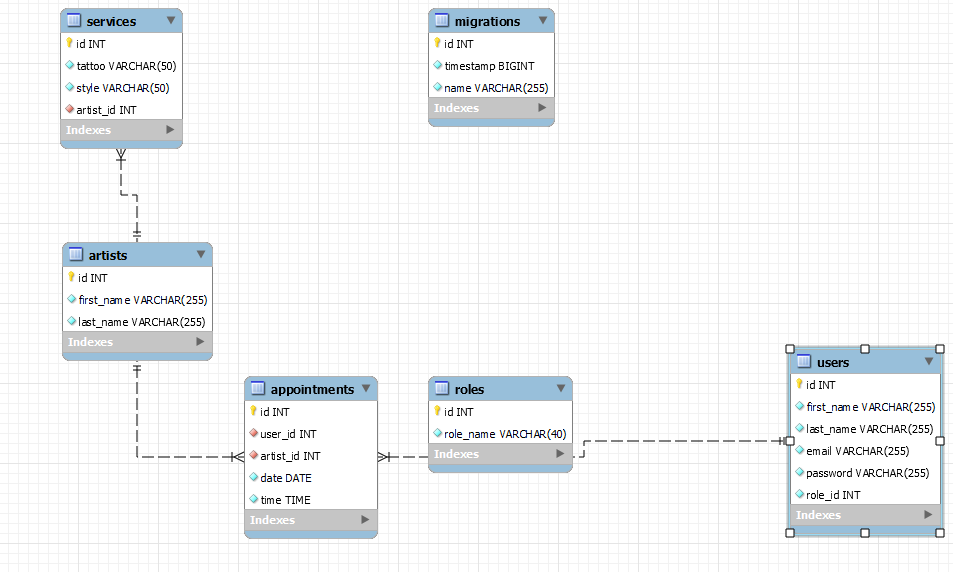

# API REST para un estudio de tatuajes 

## Descripción

El proyecto consiste en desarrollar una API RESTful para la gestión de citas  de un estudio de tauajes. La API permitirá a los usuarios realizar operaciones como registar,login , actualizar y eliminar citas, gestionar usuarios, artistas, tauajes y otros diseños


## Características Principales

- Gestión de Usuarios
- Gestión de servicios
- Gestión de citas
- Gestión de Artistas
- Visualización de citas
- Actualizacion de citas
- Actualizacion de Perfil de Usuario
- Registro y Login de Usuarios

## Endpoints principales

### Users

| Método | URI                              | Acción                     | Rol     |
|--------|----------------------------------|----------------------------|---------|
| POST    | `/api/users/register`           | Registrar                  | client  |
| POST   | `/api/users/login `              | Actualiza perfil           | client  |
| GET    | `/api/users/:id  `               | Obtener usuario            | client  |
| GET    | `/api/users/artists/list`        | Obtener lista de artistas  | client  |

### Appointments

| Método | URI                                    | Acción         | Rol         |
|--------|----------------------------------------|----------------|-------------|
| POST   | `/api/appointments/newAppointment`     | Crear cita     | client      |
| PATCH  | `/api/appointments/:id`                | Actualizar     | super admin |
| DELETE | `/api/appointments/:id`                | Eliminar citas | client      |
| GET    | `/api/appointments/mysessions/:id`     | Todas las citas| client      |
| GET    | `/api/appointments/myappointments/:id` | Elimina autor  | artist      |


##  Instalación en local
1. Clonar el repositorio
2. ` $ npm install `
3. Conectamos nuestro repositorio con la base de datos 
4. ``` $ Ejecutamos las migraciones ``` 
5. ``` $ npm run dev ```

## Tecnologías
- ORM: **TypeOrm**.
- Lenguaje:  **TypeScript**.

## Base de Datos Relacional



